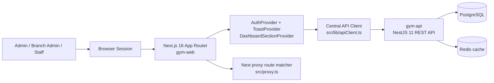
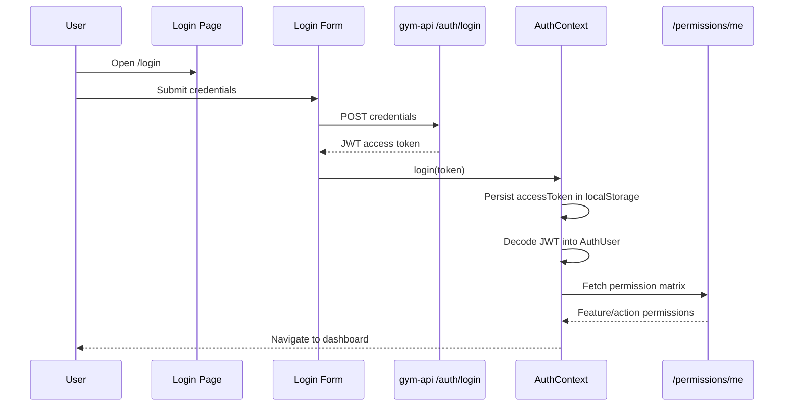
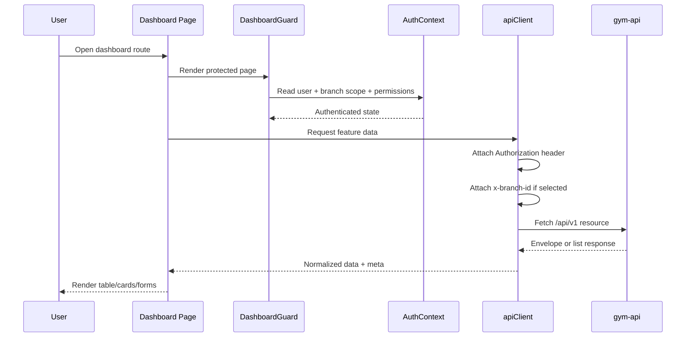
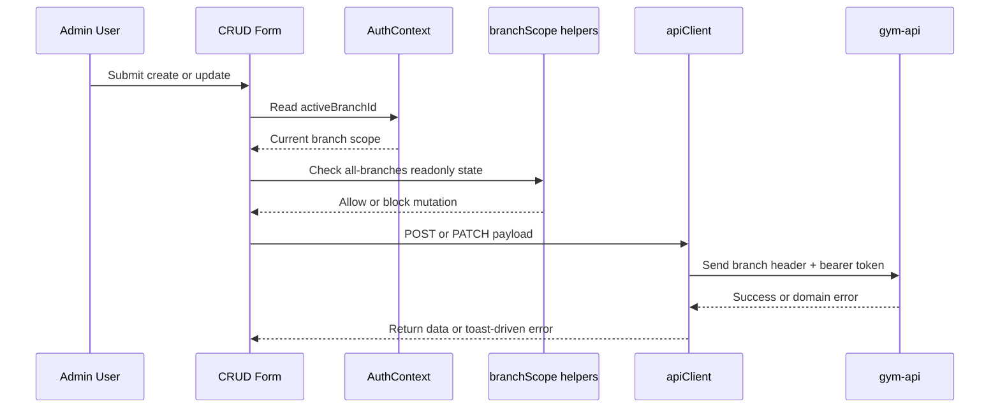
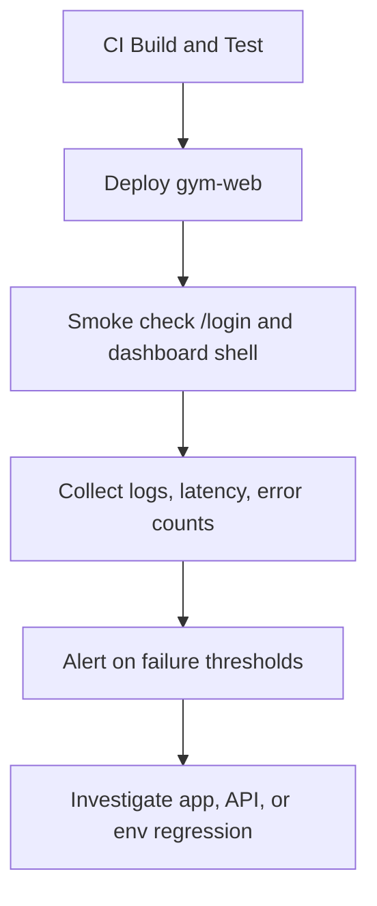

## Gym Web Infrastructure

This document describes the current architecture of the `gym-web` repository and the operational shape it should preserve while integrating with `gym-api`.

## Scope

- Frontend: single Next.js admin dashboard application in this repository
- Backend dependency: separate NestJS API in `gym-api`
- Runtime model: browser-rendered admin dashboard with shared API client, auth context, permission gating, and branch-aware requests
- Deployment target: standalone Next.js server behind a reverse proxy or container platform

## Current System Summary

- `src/app` contains the App Router surface for login and dashboard pages.
- `src/app/layout.tsx` wires global providers for auth and toast handling.
- `src/proxy.ts` handles route matching and limited server-side token checks.
- `src/contexts/AuthContext.tsx` restores the current session, branch scope, and permissions.
- `src/lib/apiClient.ts` centralizes API requests, bearer token attachment, branch header propagation, pagination normalization, and error handling.
- `src/services/*` maps feature pages to `gym-api` endpoints.
- `src/components` contains dashboard layout, forms, CRUD primitives, and shared UI.

## System Architecture Diagram

## Request Flow Diagrams

### 1. Login Flow

### 2. Authenticated Dashboard Request

### 3. Branch-Scoped Mutation Flow

## Data Isolation Strategy

### Current Strategy

- Tenant isolation is enforced by the backend, not by this frontend repository.
- The frontend never chooses a tenant database directly.
- The frontend scopes data operationally through:
  - JWT identity decoded in `AuthService`
  - permission matrix from `/permissions/me`
  - optional `x-branch-id` header for admin branch selection
  - UI-level read-only behavior when an admin is viewing all branches at once

### Effective Isolation Layers

1. Role isolation
	Admin, branch admin, and staff users see different actions and routes.
2. Branch isolation
	The active branch is stored client-side and sent explicitly on requests that support branch scoping.
3. Permission isolation
	UI actions are gated by `hasAuthority(...)` and per-feature permission checks.
4. API enforcement
	Final access control remains in `gym-api`; the UI is a convenience layer, not the trust boundary.

### Constraints To Preserve

- Do not add tenant or branch identifiers to arbitrary query strings when a validated header or existing API contract already exists.
- Do not bypass permission checks in components just to surface actions early.
- Do not treat frontend scoping as sufficient authorization.
- Keep cross-branch mutation restrictions explicit in both UI and API usage.

## Scaling Considerations

### Frontend Runtime

- The app already uses `output: 'standalone'`, which is suitable for container deployment.
- Horizontal scaling is straightforward because browser state holds auth and branch selection; the app server is effectively stateless.
- Asset delivery should be pushed to a CDN in production, especially for Next static assets and remote images.

### API Traffic

- Every dashboard view fans out into direct API calls from the browser; high-cardinality list screens will scale based on backend pagination discipline.
- Rate-sensitive endpoints should remain paginated and filterable.
- Shared query normalization in `apiClient` should remain cheap and deterministic.

### Operational Recommendations

- Run multiple `gym-web` instances behind a load balancer.
- Terminate TLS before the app container.
- Cache static assets aggressively.
- Prefer server or edge caching only for truly public, non-user-specific resources.
- Keep dashboard data uncached at the CDN layer unless the response is explicitly safe to share.

## Security Layers

### Current Layers

1. Route entry control
	`src/proxy.ts` protects dashboard route patterns and can reject obviously malformed or expired cookie tokens.
2. Client auth restoration
	`AuthContext` restores the current user from the stored access token.
3. Authorization header attachment
	`apiClient` attaches bearer tokens automatically.
4. Permission gating
	`hasAuthority(...)` prevents UI exposure of unauthorized actions.
5. Branch mutation guardrails
	`branchScope.ts` marks all-branch views as read-only for dangerous operations.
6. Backend enforcement
	`gym-api` remains the authoritative authn/authz layer.

### Known Security Reality

- The current implementation stores the access token in `localStorage`.
- Because of that, full server-side session enforcement in `src/proxy.ts` is limited unless a secure cookie is also issued.
- This is an architectural constraint of the current repo, not a documentation bug.

### Recommended Hardening Path

- Move access tokens to secure, httpOnly cookies if the auth model is changed intentionally.
- Add CSP, stricter security headers, and cookie-based refresh semantics when backend support is ready.
- Keep error messages user-safe and avoid surfacing raw backend internals.
- Maintain strict separation between display permissions and actual write authorization.

## Monitoring & Health Checks

### What To Monitor

- App availability: successful response from `/login` and core dashboard routes
- API reachability: ability to reach `NEXT_PUBLIC_API_BASE_URL`
- Frontend error rate: fetch failures, auth redirects, unexpected render crashes
- Latency: list pages and dashboard summary views
- Build health: `npm run build`
- Test health: `npm run test`
- Lint health: `npm run lint`

### Suggested Health Model

### Recommended Checks

- CI: run lint, tests, and build on every PR
- Runtime smoke: verify `/login` renders and at least one authenticated route loads after login
- Synthetic API probe: validate a known endpoint on `gym-api` responds as expected
- Browser-side telemetry: capture unhandled errors and failed fetches

## Backup Strategy

This frontend repository is mostly stateless at runtime, so backup strategy centers on source, artifacts, and dependent systems.

### What Must Be Protected

- Git history for `gym-web`
- Deployment manifests or container definitions
- Environment variable definitions outside the repo
- Build artifacts only if your platform does not rebuild from source
- Backend databases and Redis in `gym-api`, because business data does not live in this frontend

### Recommended Backup Plan

1. Source control
	Use remote Git hosting as the primary recovery source.
2. Environment recovery
	Store production env vars in a managed secret store with version history.
3. Artifact recovery
	Keep reproducible builds so redeploying from Git is the default recovery path.
4. Backend data recovery
	Ensure PostgreSQL backups, restore drills, and point-in-time recovery are owned by the API infrastructure.
5. Configuration recovery
	Keep deployment config under version control where possible.

## Operational Notes

- `NEXT_PUBLIC_API_BASE_URL` is the main external dependency and should be treated as a required deployment input.
- Remote images are currently allowed from Unsplash, UI Avatars, and DiceBear as configured in `next.config.ts`.
- The frontend is only as healthy as the backend contracts it consumes; treat API drift as an availability risk.
